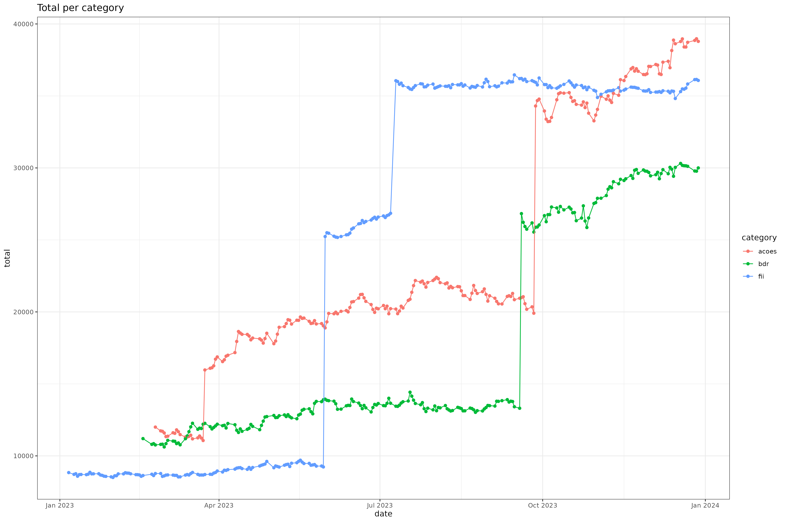

## Stock portfolio analysis 

This mini project enables:

- track realtime results of your stock portfolio
- track historic results of your stock portfolio

## Instructions

- Install the following R libraries.

  ```
  install.packages("tidyverse")
  install.packages("readxl")
  install.packages("lubridate")
  install.packages("googledrive")
  install.packages("tidyquant")
  ```

- Copy and fill the blue cells in the [template spreadsheet](https://docs.google.com/spreadsheets/d/1H7APdQhZKSnUgFOefXTshJa1AwwW_H7eY3Tg4dgo-ts/edit#gid=72283122) with your current positions. The spreadsheet uses [GoogleFinance functions](https://support.google.com/docs/answer/3093281?hl=en) to update quotations with a 20-minute delay.

- Update the code with the Google Drive ID of your spreadsheet.

  ```
  my_spreadsheet = "1H7APdQhZKSnUgFOefXTshJa1AwwW_H7eY3Tg4dgo-ts"
  ```
- Run script, which will automatically:
  
  - connect to your Google Drive account (OAuth) and download the spreadsheet to local folder.
  - download daily quotations for each ticker from [tidyquant](https://cran.r-project.org/web/packages/tidyquant/vignettes/TQ00-introduction-to-tidyquant.html).
  - generate charts.
  
- If you buy or sell, update the spreadsheet and run the script again.


## Sample Charts



